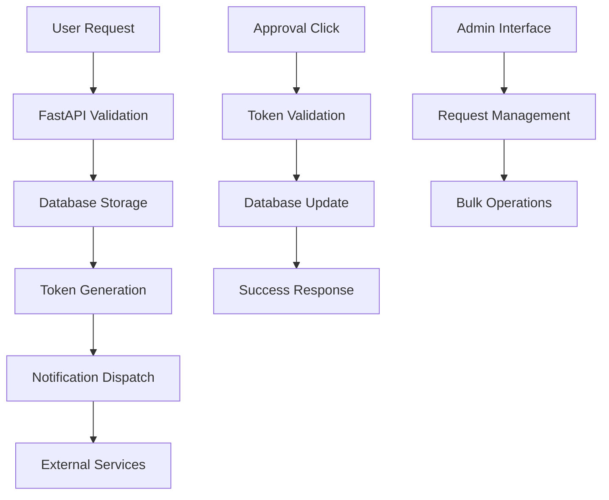

# 🎨 System Architecture

This document provides an overview of the audiobook automation system architecture, designed for developers who want to understand how the system works internally.

## 🏗️ High-Level Architecture

```
┌─────────────────┐    ┌─────────────────┐    ┌─────────────────┐
│   Web Browser   │◄──►│   FastAPI Web   │◄──►│   SQLite DB     │
│   (Frontend)    │    │   Application   │    │   (Storage)     │
└─────────────────┘    └─────────────────┘    └─────────────────┘
                                │
                                ▼
                       ┌─────────────────┐
                       │  Notification   │
                       │    Services     │
                       │ (Discord, etc.) │
                       └─────────────────┘
```

## 📁 Project Structure

```
audiobook_dev/
├── docs/                    # Documentation (this folder)
│   ├── user-guide/         # User documentation
│   ├── development/        # Developer documentation
│   └── api/                # API documentation
├── src/                    # Source code
│   ├── main.py            # Application entry point
│   ├── webui.py           # FastAPI web interface
│   ├── db.py              # Database operations
│   ├── config.py          # Configuration management
│   ├── utils.py           # Utility functions
│   ├── metadata.py        # Audiobook metadata handling
│   ├── qbittorrent.py     # qBittorrent integration
│   ├── token_gen.py       # Token generation/validation
│   ├── html.py            # HTML template utilities
│   └── notify/            # Notification modules
│       ├── discord.py     # Discord notifications
│       ├── gotify.py      # Gotify notifications
│       ├── ntfy.py        # Ntfy notifications
│       └── pushover.py    # Pushover notifications
├── templates/             # Jinja2 HTML templates
│   ├── base.html         # Base template
│   ├── index.html        # Home page
│   ├── approval.html     # Approval page
│   ├── rejection.html    # Rejection page
│   ├── success.html      # Success page
│   ├── failure.html      # Failure page
│   ├── token_expired.html # Token expired page
│   └── 401_page.html     # Unauthorized page
├── static/               # Static web assets
│   ├── css/
│   │   └── style.css     # Main stylesheet
│   └── js/
│       └── app.js        # Main JavaScript
├── tests/                # Test suite
├── config/               # Configuration files
│   └── config.yaml       # Main configuration
├── logs/                 # Application logs
└── db.sqlite            # SQLite database
```

## 🔧 Core Components

### 1. Web Application (`webui.py`)

**FastAPI-based web server** that handles:

- **HTTP Routes** - All web endpoints and API routes
- **Template Rendering** - Jinja2 template processing
- **Request Handling** - Form processing and validation
- **Authentication** - Token-based security
- **Static File Serving** - CSS, JS, and asset delivery

Key endpoints:
- `GET /` - Home page
- `POST /audiobook-requests` - Submit new requests
- `GET /approve/{token}` - Approval endpoint
- `GET /reject/{token}` - Rejection endpoint
- `GET /requests` - Browse requests

### 2. Database Layer (`db.py`)

**SQLite-based data persistence** with:

- **Request Storage** - Audiobook request data
- **Token Management** - Approval/rejection tokens
- **Audit Logging** - Request history and changes
- **Schema Management** - Database initialization and migrations

Database schema:
```sql
CREATE TABLE requests (
    id INTEGER PRIMARY KEY,
    title TEXT NOT NULL,
    author TEXT,
    status TEXT DEFAULT 'pending',
    created_at TIMESTAMP DEFAULT CURRENT_TIMESTAMP,
    updated_at TIMESTAMP DEFAULT CURRENT_TIMESTAMP
);

CREATE TABLE tokens (
    id INTEGER PRIMARY KEY,
    token TEXT UNIQUE NOT NULL,
    request_id INTEGER,
    action TEXT NOT NULL,
    expires_at TIMESTAMP NOT NULL,
    used_at TIMESTAMP,
    FOREIGN KEY (request_id) REFERENCES requests (id)
);
```

### 3. Configuration System (`config.py`)

**YAML-based configuration** handling:

- **Environment-aware** - Development vs production settings
- **Validation** - Configuration validation and defaults
- **Hot-reloading** - Dynamic configuration updates
- **Security** - Sensitive data handling

### 4. Notification System (`notify/`)

**Multi-platform notification delivery** supporting:

- **Discord** - Webhook-based Discord notifications
- **Gotify** - Self-hosted push notifications
- **Ntfy** - Simple push notification service
- **Pushover** - Mobile push notifications

Each notification module implements a common interface:
```python
class NotificationService:
    def send_approval_request(self, request_data: dict) -> bool
    def send_approval_notification(self, request_data: dict) -> bool
    def send_rejection_notification(self, request_data: dict) -> bool
```

### 5. Token System (`token_gen.py`)

**Cryptographically secure token management** with:

- **URL-safe tokens** - Base64-encoded random tokens
- **Expiration handling** - Time-based token validity
- **Single-use enforcement** - Prevents token reuse
- **Secure validation** - Constant-time comparison

### 6. Frontend Architecture (`static/`)

**Modern, CSP-compliant frontend** featuring:

- **External CSS/JS** - No inline styles or scripts
- **Responsive Design** - Mobile-first approach
- **Progressive Enhancement** - Works without JavaScript
- **Accessibility** - WCAG 2.1 AA compliance
- **Modern CSS** - CSS Grid, Flexbox, custom properties

## 🔐 Security Architecture

### Content Security Policy (CSP)
```http
Content-Security-Policy: 
    default-src 'self'; 
    style-src 'self' fonts.googleapis.com; 
    font-src 'self' fonts.gstatic.com; 
    img-src 'self' picsur.kingpaging.com; 
    script-src 'self'
```

### Token Security
- **Cryptographically random** tokens (32 bytes)
- **Time-limited** validity (configurable expiration)
- **Single-use** enforcement
- **Secure transmission** (HTTPS recommended)

### Input Validation
- **Server-side validation** for all user inputs
- **SQL injection prevention** via parameterized queries
- **XSS protection** via template escaping
- **CSRF protection** via token validation

## 🚀 Request Flow

### 1. Request Submission
```
User submits form → FastAPI validates → Database stores → Notification sent
```

### 2. Approval Process
```
User clicks approval link → Token validated → Database updated → Success page shown
```

### 3. Notification Flow
```
Event triggered → Notification service called → Message formatted → External service delivery
```

## 📊 Data Flow



## 🔄 Error Handling

### Application Errors
- **Graceful degradation** - System continues operating with reduced functionality
- **User-friendly messages** - Clear error communication
- **Detailed logging** - Comprehensive error tracking
- **Recovery mechanisms** - Automatic retry and fallback options

### Database Errors
- **Connection pooling** - Manages database connections efficiently
- **Transaction rollback** - Maintains data consistency
- **Backup strategies** - Regular database backups
- **Migration support** - Schema version management

## 🧪 Testing Architecture

### Test Categories
- **Unit Tests** - Individual component testing
- **Integration Tests** - Cross-component functionality
- **End-to-End Tests** - Full workflow validation
- **Performance Tests** - Load and stress testing

### Test Structure
```
tests/
├── conftest.py              # Test configuration
├── test_config.py           # Configuration tests
├── test_database_integration.py # Database tests
├── test_end_to_end.py       # E2E tests
├── test_main_integration.py # Application tests
├── test_webui.py           # Web interface tests
└── test_*.py               # Feature-specific tests
```

## 📈 Performance Considerations

### Optimization Strategies
- **Database indexing** - Optimized query performance
- **Static file caching** - Browser cache optimization
- **Template caching** - Jinja2 template compilation caching
- **Connection pooling** - Efficient resource utilization

### Monitoring
- **Request logging** - Detailed request/response logging
- **Performance metrics** - Response time tracking
- **Error monitoring** - Exception tracking and alerting
- **Resource usage** - CPU, memory, and disk monitoring

## 🔧 Development Workflow

### Local Development
1. **Setup** - Virtual environment and dependencies
2. **Configuration** - Development-specific settings
3. **Database** - Local SQLite database
4. **Testing** - Automated test execution
5. **Debugging** - Enhanced logging and debugging tools

### Production Deployment
1. **Environment setup** - Production server configuration
2. **Database migration** - Schema updates and data migration
3. **Static asset optimization** - Minification and compression
4. **Process management** - Service management and monitoring
5. **Backup strategies** - Data protection and recovery

---

This architecture supports the system's core principles:
- **Simplicity** - Easy to understand and maintain
- **Security** - Built with security best practices
- **Scalability** - Designed to handle growth
- **Maintainability** - Clean, documented codebase
- **User Experience** - Intuitive and responsive interface
